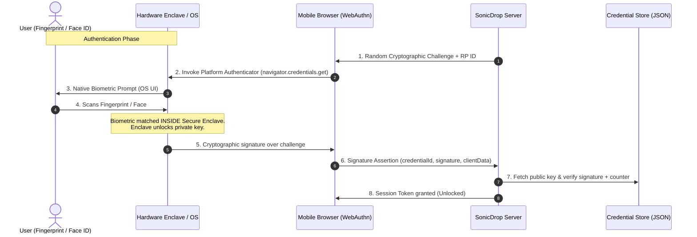

# 🔊 SonicDrop

> **Zero-click, zero-pairing file transfer** via near-ultrasound acoustic handshaking (18.5–20 kHz) + WebRTC DataChannels + **Native Biometric Application Lock (WebAuthn / Passkeys)**.  
> No QR codes. No pairing PINs. No cloud. Direct peer-to-peer device transfers secured by your hardware biometric sensor.

---

## 🔐 Biometric Application Lock

SonicDrop includes a **native biometric application lock** built using standard **WebAuthn / FIDO2 Passkeys**.

```text
┌─────────────────────────────┐
│          SonicDrop          │
│                             │
│           🔐 LOCKED         │
│                             │
│     Unlock SonicDrop        │
│                             │
│   [ 👆 Unlock with          │
│       Fingerprint ]         │
│                             │
└─────────────────────────────┘
```

The biometric lock directly protects the **mobile sender interface** (`sender.html`). While SonicDrop is locked:
* 🚫 Microphone sampling is disabled.
* 🚫 Near-ultrasound acoustic discovery cannot start.
* 🚫 No WebRTC peer connections or data transfers are permitted.
* 🚫 Joining signaling rooms without an authenticated session is rejected by the server.

Once unlocked via **Fingerprint, Face ID, or Touch ID**, SonicDrop initiates acoustic listening and enables zero-click peer-to-peer transfers.

---

## 🛡️ Critical Privacy & Security Guarantee

### Why SonicDrop Never Sees Your Biometrics

> [!IMPORTANT]
> **SonicDrop NEVER receives, accesses, transmits, or stores raw biometric data.**
>
> * ❌ No fingerprint images or scans
> * ❌ No fingerprint feature templates or minutiae
> * ❌ No face images or facial geometry
> * ❌ No sensor data or raw biometric signals
> * ❌ No private keys

### How WebAuthn Works Under the Hood

Authentication is delegated entirely to the device's operating system and secure hardware enclave (Android KeyStore, Apple Secure Enclave, or Windows TPM):



**What the Server Actually Stores:**
* Cryptographic Public Key (`credentialPublicKey`)
* Ephemeral Credential ID (`credentialID`)
* Monotonic Signature Counter (`counter` to prevent replay attacks)
* Anonymous Device ID (`deviceId`)

The private key never leaves the user's hardware.

---

## 🔄 Dual Architecture: Authentication & Acoustic Discovery

```
                         SonicDrop
                             │
                     ┌───────┴────────┐
                     │                │
                Authentication     Discovery
                     │                │
                 WebAuthn           ggwave
                     │                │
                     ▼                ▼
               Biometric ✓       Room ID detected
                     │                │
                     └───────┬────────┘
                             ▼
                       WebRTC P2P
                             │
                             ▼
                        File Transfer
```

---

## 🚀 How It Works (Step-by-Step)

```
Desktop (Receiver)                         Mobile (Sender)
──────────────────                         ───────────────
                                           1. Open SonicDrop
                                           2. 🔐 Native Biometric Prompt (WebAuthn)
                                           3. Fingerprint / Face ID verified
                                           4. Select file(s) or paste text
                                           5. Tap "Send File(s)"
1. Generate Room ID "839A"
2. Emit inaudible ultrasound               6. Microphone samples acoustic beacon
   beacon encoding "839A"  ────────►       7. ggwave decodes Room ID "839A"
   via speakers (18.5–20 kHz)
3. Both join WebSocket room ◄────────►    8. Sender joins room (with session token)
4. Exchange SDP Offer/Answer               9. Exchange ICE candidates
5. Direct RTCDataChannel established      10. Direct RTCDataChannel established
   ◄━━━━━━━━━━━━━━━━━━━━━━━━━━━━━━━━━     11. Stream file in 64 KB chunks
6. Reassemble → auto-download                 with backpressure control
```

---

## 📂 Project Structure

```
sonicdrop/
├── server.js                        ← Node.js HTTP server & WebSocket signaling relay
├── authRoutes.js                    ← WebAuthn Level 2/3 endpoints (/api/auth/*)
├── authStore.js                     ← Credential persistence (public keys & counters only)
├── test-biometric.js                ← Automated end-to-end verification test suite
├── package.json
├── README.md
├── data/                            ← Local file store for registered credentials (public only)
│   └── credentials.json
└── public/
    ├── index.html                   ← Receiver page (desktop sonar & tone emitter)
    ├── sender.html                  ← Sender page (mobile biometric lock + ultrasonic receiver)
    ├── simplewebauthn-browser.min.js← Local WebAuthn browser client bundle (offline ready)
    ├── utils.js                     ← Shared ES module (STUN, WebRTC config, speed calculator)
    ├── ggwave.js                    ← Audio FSK WebAssembly DSP
    ├── manifest.json                ← PWA configuration with Web Share Target
    ├── sw.js                        ← Service Worker (offline shell cache & share target)
    └── icons/                       ← PWA app icons (192x192, 512x512, SVG)
```

---

## 📱 User Experience & Flows

### 1. First-Time Setup
1. Open `https://<your-domain>/sender` on mobile.
2. SonicDrop detects no passkey exists for this device.
3. Lock screen shows: **"Set Up Biometric Unlock"**.
4. User taps **"Enable Fingerprint"** (or Face ID / Touch ID).
5. The device displays the native OS biometric prompt.
6. User scans finger / face.
7. Device registers public key with SonicDrop and unlocks.

### 2. Returning User Flow
1. Open `https://<your-domain>/sender`.
2. Lock screen displays: **"SonicDrop is Locked"**.
3. User taps **"Unlock with Fingerprint"**.
4. Native biometric prompt verifies identity.
5. SonicDrop unlocks into the file sender view.

### 3. Manual Lock
* While unlocked, a **"Lock"** badge button is visible in the top header.
* Tapping **"Lock"** immediately closes active audio sampling, clears the session, and locks the interface.

### 4. Background & Lifecycle Behavior
* If the user switches away from the browser, microphone listening is suspended immediately.
* If backgrounded for more than 5 minutes, SonicDrop auto-locks to prevent unauthorized access.
* Active WebRTC transfers in progress are preserved until completion.

---

## 🌐 HTTPS Requirement

Both **WebAuthn** and **Microphone Access** (`getUserMedia`) require a **Secure Context** (`https://` or `http://localhost`).

### Local Development / Testing
* Testing on the same machine works at `http://localhost:8080`.
* For mobile phone testing, use one of the tunnels below.

### Exposing via ngrok (Recommended for Phones)
```bash
# Terminal 1: Run SonicDrop
npm start

# Terminal 2: Expose HTTPS tunnel
npx ngrok http 8080
```
Open the generated `https://xxxx.ngrok-free.app/sender` on your smartphone.

### Exposing via Cloudflare Tunnel
```bash
cloudflared tunnel --url http://localhost:8080
```

---

## 💻 How to Run (Windows Commands)

### 1. Install Dependencies
```powershell
npm install
```

### 2. Run Automated Test Suite
```powershell
node test-biometric.js
```
Runs 36 comprehensive checks covering:
* WebAuthn options generation
* Cryptographic challenge validation
* Replay attack prevention (single-use challenges)
* Invalid payload rejection
* Ephemeral session creation, validation, and manual lock
* WebSocket room joining with session enforcement
* WebRTC SDP offer/answer and ICE candidate relay
* Static file and PWA caching

### 3. Start the Server
```powershell
npm start
```
* **Receiver (Desktop):** `http://localhost:8080/`
* **Sender (Mobile):** `http://localhost:8080/sender`

---

## 🧪 Device-Specific Testing Instructions

### Testing on Android (Chrome)
1. Expose server via HTTPS (`npx ngrok http 8080`).
2. Open Chrome on Android and navigate to `https://<ngrok-url>/sender`.
3. Tap **"Enable Fingerprint"**.
4. Android's native biometric bottom-sheet appears ("Verify it's you").
5. Scan your fingerprint $\rightarrow$ App unlocks instantly.
6. Tap the **"Lock"** button in the header $\rightarrow$ App locks.
7. Tap **"Unlock with Fingerprint"** $\rightarrow$ Scan fingerprint $\rightarrow$ Unlocks.
8. Test failure: Scan an unregistered finger $\rightarrow$ Native Android shows "Fingerprint not recognized", app remains locked.

### Testing on iPhone (Safari)
1. Expose server via HTTPS (`npx ngrok http 8080`).
2. Open Safari on iOS and navigate to `https://<ngrok-url>/sender`.
3. Tap **"Enable Face ID / Touch ID"**.
4. iOS shows native passkey prompt ("Sign in with Passkey").
5. Glance at TrueDepth camera (Face ID) or scan Touch ID $\rightarrow$ App unlocks.
6. Tap **"Lock"** $\rightarrow$ Locks. Tap **"Unlock with Face ID"** $\rightarrow$ Re-authenticates.

### Testing on Desktop (Windows Hello / Mac Touch ID)
* In Chrome/Edge on Windows 11: Prompt triggers **Windows Hello** (Fingerprint, PIN, or facial recognition).
* In Safari/Chrome on macOS: Prompt triggers **Mac Touch ID**.
* In browsers without platform biometric hardware: An informative card is displayed explaining that biometric hardware is unavailable, with a **"Continue to SonicDrop"** fallback.

---

## ⚡ Architecture Specifications

| Component | Technology | Security / Detail |
|---|---|---|
| **Biometric Auth** | W3C WebAuthn / Passkeys Level 2 & 3 | `@simplewebauthn/server` v14 + `@simplewebauthn/browser` |
| **User Verification** | `userVerification: "required"` | Enforces biometric verification at the authenticator |
| **Credential Storage** | File-backed JSON (`data/credentials.json`) | Public keys, counter, credential IDs only (zero biometrics) |
| **Replay Prevention** | Single-use challenges + Monotonic Counters | Challenges deleted upon first verification; counters validated |
| **Signaling** | Native Node.js `ws` WebSocket | Ephemeral 4-character rooms with 5-minute TTL |
| **Acoustic Discovery** | `ggwave` WASM (18.5–20 kHz) | Inaudible near-ultrasound beaconing |
| **File Transfer** | WebRTC DataChannels | Direct P2P encrypted with DTLS |
| **Flow Control** | 64 KB binary chunks | Backpressure thresholds (16 MB high-water, 2 MB low-water) |

---

## 📄 License
MIT
